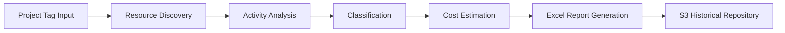

# AWS-Stale-Resource-Analyzer

AWS-Stale-Resource-Analyzer is an AWS-based governance and FinOps utility designed to identify stale AWS resources associated with specific business projects using resource tags. It helps organizations discover cloud resources that match project ownership tags, show little or no recent activity, and may be contributing to unnecessary spend or governance risk.

The solution is deterministic by design and does not use AI. It focuses on visibility, analysis, and reporting so teams can make informed decisions about cleanup, rightsizing, and lifecycle governance.

## Why this solution exists

Organizations frequently accumulate cloud resources that are no longer actively used but remain provisioned. These can include idle EC2 instances, unattached EBS volumes, expired snapshots, unused Lambda functions, old security groups, and stale storage.

Over time, these resources create a combination of issues:

- Unnecessary monthly cloud spend
- Reduced cost accountability at the project level
- Increased governance complexity
- Security and compliance drift
- Operational noise for teams managing AWS environments

Tag-based governance is a critical control because AWS resources are often grouped by business context such as project, application, environment, owner, or cost center. When resource tags are consistently applied, teams can evaluate whether resources are still relevant to the intended workload.

AWS-Stale-Resource-Analyzer adds automated visibility so teams do not have to manually inspect AWS accounts or rely on incomplete spreadsheets. It creates a regular, repeatable process for discovering and reporting on potentially stale resources.

## Executive summary

AWS-Stale-Resource-Analyzer provides a practical governance workflow for AWS users who need to:

- Find resources belonging to a specific project tag
- Detect low-activity or inactive resources over a configurable period
- Estimate wasted spend and potential savings
- Classify each resource by governance urgency
- Produce an Excel-based governance report
- Store historical versions in Amazon S3 for audit and trend review

This makes the tool useful for both engineering and financial stakeholders. It promotes accountability, supports FinOps efforts, and improves operational hygiene across AWS environments.

## Business problem addressed

The central problem is simple: resources that are still deployed but not actively used can silently increase cloud costs and complicate governance. This problem commonly occurs when:

- Projects end without full decommissioning
- Development environments remain active beyond their usefulness
- Teams are not required to clean up test environments
- Shared resources are not mapped to active ownership
- Cost visibility is not tied to project usage patterns

Without automated detection, stale resources remain invisible until monthly billing, incident response, or audit activities highlight them. AWS-Stale-Resource-Analyzer addresses this by making inactiveness visible in a structured, repeatable way.

## Why automated visibility matters

Manual reviews are slow, error-prone, and difficult to scale. In AWS estates with many accounts, regions, and project tags, business teams need reporting automation to identify which resources require attention. AWS-Stale-Resource-Analyzer introduces a regular cadence of governance reporting so organizations can:

- Discover stale resources earlier
- Prioritize cleanup based on cost and risk
- Support project owners with objective evidence
- Track historical reports and improvement over time
- Align cloud operations with standardized governance policies

## Solution overview

AWS-Stale-Resource-Analyzer is a cloud governance and reporting solution that discovers resources that match configured tags, analyzes their recent activity, and creates an Excel report that highlights potential stale assets and optimization opportunities.

The solution combines several AWS capabilities into a single operational workflow:

- Tag-based discovery of relevant AWS resources
- Inactivity analysis across configurable time windows
- Cost estimation using AWS pricing and Cost Explorer data
- Resource classification by state and risk
- Excel report generation for review and distribution
- Historical report retention in Amazon S3

### High-level workflow

1. A configured project tag is provided, such as `Project=TeamX`.
2. AWS resource APIs discover resources matching the project tag.
3. Activity is evaluated using CloudTrail and CloudWatch data.
4. Resources are classified based on inactivity, usage, and cost signals.
5. Estimated savings are calculated for candidate cleanup items.
6. A governance report is generated in Excel format.
7. The report is stored in Amazon S3 for historical tracking and review.



## Key features

AWS-Stale-Resource-Analyzer includes a focused set of governance features designed for practical AWS operations:

- Tag-based discovery across AWS resources tied to a business project
- Configurable inactivity thresholds for identifying stale resources
- Multi-region scanning for broader visibility across the estate
- Resource classification into review categories such as idle, risky, or candidate for cleanup
- Cost estimation to highlight potential waste and savings
- Historical reporting to compare monthly or quarterly governance posture
- CloudTrail integration for activity context and operational evidence
- CloudWatch metric analysis to support idle and low-usage detection
- S3 storage for report retention and lifecycle management
- EventBridge scheduling for recurring governance checks
- Terraform deployment for repeatable infrastructure provisioning
- CI/CD support via GitHub Actions to automate the delivery workflow

## Architecture at a glance

The solution combines infrastructure automation, AWS service integrations, and reporting into a structured lifecycle:

- GitHub Actions orchestrates deployment workflows and automation triggers
- Terraform provisions the AWS infrastructure required by the solution
- EventBridge schedules recurring governance executions
- Lambda runs the logic to discover resources, collect activity, estimate cost, and generate reports
- CloudWatch Metrics and CloudTrail supply operational and usage data
- AWS Resource APIs and Cost Explorer provide inventory and financial context
- Excel reports are generated for stakeholder review
- S3 stores current and historical reports for governance and audit use

For a detailed architecture walkthrough, see [architecture.md](architecture.md).

## Repository documentation

This repository includes the following documentation:

- [README.md](README.md) — landing page and overview
- [architecture.md](architecture.md) — system architecture and AWS component responsibilities
- [workflow.md](workflow.md) — discovery workflow and operational process
- [report-generation.md](report-generation.md) — report content, classification, and storage patterns
- [future-enhancements.md](future-enhancements.md) — roadmap, limitations, and AI enhancement vision

## Repository structure

Although the current repository is documentation-focused, the project is typically organized around the following folders and responsibilities:

```text
.
├── .github/
│   └── workflows/
│       └── deployment.yml          # CI/CD automation and deployment orchestration
├── infrastructure/
│   └── terraform/
│       ├── main.tf                 # Core Terraform provisioning
│       ├── variables.tf            # Deployment parameters and tag configuration
│       ├── outputs.tf              # Generated values and outputs
│       └── modules/                # Reusable infrastructure components
├── lambda/
│   ├── stale-resource-discovery/   # Resource enumeration and tagging logic
│   ├── activity-analysis/          # CloudTrail and CloudWatch evaluation
│   ├── cost-analysis/              # Cost Explorer and pricing integration
│   └── report-generator/           # Excel workbook creation logic
├── reports/
│   └── Project-TeamX/
│       └── 2026/
│           └── 08/
│               └── ...             # Historical governance reports stored in S3 style structure
├── docs/
│   ├── architecture.md             # Architecture reference
│   ├── workflow.md                 # Operational workflow
│   ├── report-generation.md        # Reporting details
│   └── future-enhancements.md      # Roadmap and AI vision
├── README.md                       # Landing page and project overview
└── LICENSE                         # Repository licensing terms, if applicable
```

Folder responsibilities:

- `.github/workflows/` contains deployment and automation pipelines used to validate and deploy the solution.
- `infrastructure/terraform/` defines the AWS resources, permissions, schedules, and supporting services via infrastructure as code.
- `lambda/` contains the business logic used to enumerate resources, inspect usage, estimate savings, and generate the output report.
- `reports/` is the archival location for project-specific result sets and historical Excel exports.
- `docs/` holds supporting technical documentation and architecture references.

## Deployment overview

AWS-Stale-Resource-Analyzer is designed to be deployed in a repeatable, infrastructure-as-code model. The deployment workflow typically includes:

1. Source-controlled configuration for AWS resources and automation
2. Terraform provisioning of the supporting base infrastructure
3. Deployment of Lambda-based business logic and permissions
4. Configuration of EventBridge schedules for recurring execution
5. Setup of report storage and retention policies in S3
6. Validation of project tags and operational thresholds

The deployment model is appropriate for team environments that want consistent governance automation without manual operational overhead.

## Current limitations

AWS-Stale-Resource-Analyzer is intentionally focused on reporting and visibility. The current design acknowledges several limitations:

- Single-account scanning in the current implementation model
- Report-only execution without automated remediation
- No approval or review workflow embedded in the system
- No direct owner-to-resource mapping for all workloads
- No AI-driven insight generation in the active implementation
- Dependency on consistent and accurate tagging for success

These constraints are described in more detail in [future-enhancements.md](future-enhancements.md).

## Benefits

AWS-Stale-Resource-Analyzer creates measurable value across multiple dimensions:

### Cost optimization

By surfacing idle and stale resources, the solution helps reduce unnecessary expenditure and supports FinOps accountability.

### Cloud governance

It gives project owners a structured view of whether resources are still aligned with real-world business usage.

### Operational excellence

The reporting cadence reduces manual effort and ensures regular governance checks across AWS environments.

### Security posture

Removing stale and unmanaged resources lowers the exposure surface and reduces hidden configuration drift.

### Audit readiness

Stored reports create an evidence trail that supports internal review, governance assurance, and historical accountability.

### Resource visibility

Teams gain better awareness of what exists, how it is tagged, and whether it is still valuable to the business.

### Developer accountability

Project-based reporting encourages ownership and clearer lifecycle hygiene at the resource level.

## Future roadmap

The current solution establishes the reporting foundation. The next evolution includes:

- Trend analysis across time windows
- Approval workflows for cleanup recommendations
- Automated remediation for clearly validated resources
- Broader cross-account and multi-organization support
- AI-powered governance guidance for explanation and prioritization

See [future-enhancements.md](future-enhancements.md) for the full roadmap and AI vision.

## Conclusion

AWS-Stale-Resource-Analyzer exists to solve a common cloud operations challenge: identifying resources that remain provisioned long after they should have been retired. It improves governance, supports FinOps, and gives teams better visibility into project-level resource utilization.

The solution is intentionally practical and deterministic. It delivers measurable business value through visibility, resource classification, and historical reporting. While AI is not part of the current implementation, the platform lays the groundwork for future intelligent governance enhancement and automated decision support.

For more detail, review the specialized documents in this repository and continue with the architecture, workflow, and reporting sections.
