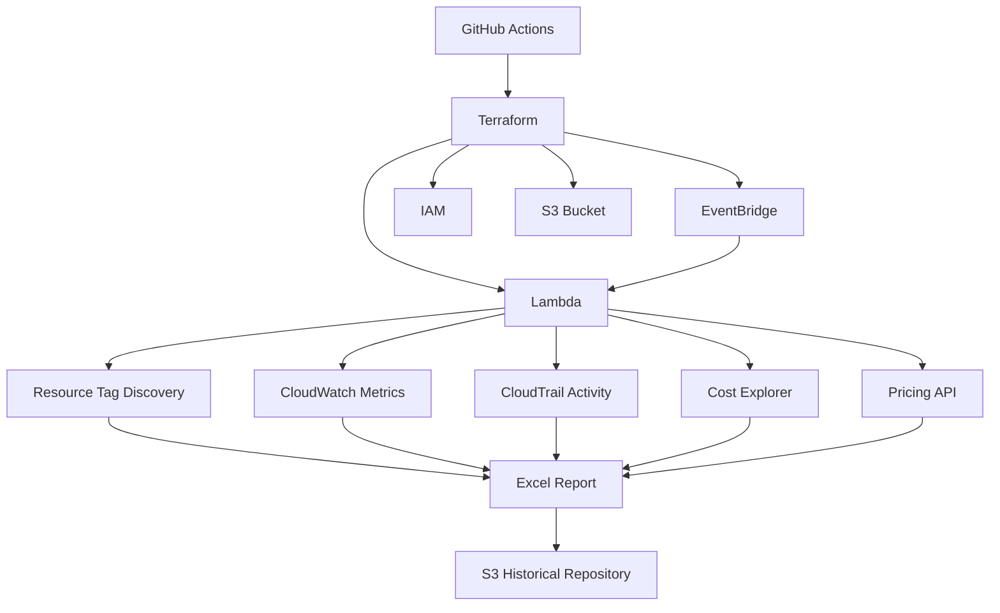

# Architecture

## Overview

AWS-Stale-Resource-Analyzer is implemented as an AWS-native governance platform that uses infrastructure-as-code deployment, scheduled event processing, AWS service integrations, and report generation to identify stale resources tied to project tags.

The architecture is designed to be operationally simple, deterministic, and easy to review. It does not rely on AI or advanced clustering logic. Instead, it uses explicit rules, resource tagging, AWS APIs, and usage signals to perform governance analysis.

## Core architecture components

### GitHub Actions

GitHub Actions provides the automation layer for deployment, validation, and infrastructure change workflows. It acts as the control plane for configuration and delivery.

Responsibilities:

- Execute Terraform deployment workflows
- Trigger validation and deployment steps in CI/CD pipelines
- Standardize configuration for environment setups
- Support repeatable rollout for the reporting solution
- Maintain a change-controlled delivery model for AWS resources

### Terraform

Terraform is used to define and provision the infrastructure that underpins the governance solution.

Responsibilities:

- Provision Lambda functions and supporting resources
- Create the S3 bucket used for report storage
- Configure IAM roles and permissions
- Define EventBridge schedules and triggers
- Establish infrastructure consistency across environments

### Lambda

Lambda is the main processing engine for the AWS-Stale-Resource-Analyzer workflow. It handles the analytical logic that gathers resource information, inspects activity, estimates cost, and creates the final Excel governance output.

Responsibilities:

- Discover AWS resources by project tag
- Query CloudWatch Metrics for usage and activity context
- Retrieve CloudTrail events for recent operational signals
- Call AWS Resource APIs for inventory collection
- Query Cost Explorer and Pricing APIs for estimated savings
- Aggregate findings into a governed report model
- Generate the final Excel workbook

### CloudWatch Metrics

CloudWatch Metrics provide usage and performance insights that help identify low-activity or idle resources.

Responsibilities:

- Capture signals such as CPU utilization, network activity, request count, and usage patterns
- Support low-activity classification for services such as EC2 and Lambda
- Improve confidence in identifying stale or underused resources
- Complement CloudTrail-based activity checks with resource-level telemetry

### CloudTrail

CloudTrail provides operational event visibility and supports the historical activity analysis for the resource set.

Responsibilities:

- Track management and API activity across AWS services
- Identify whether resources have recently changed or been used
- Validate whether a resource has been active during the configured inactivity window
- Help separate genuinely idle assets from assets that continue to receive periodic updates

### AWS Resource APIs

AWS Resource APIs are used to enumerate and inspect the resources associated with the configured project tags.

Responsibilities:

- Discover EC2, EBS, Lambda, RDS, IAM, S3, and snapshot resources
- Inspect resource metadata and tagging
- Identify assets that match governance criteria
- Feed the analysis engine with a complete resource inventory for the relevant project scope

### Cost Explorer

Cost Explorer provides the cost perspective needed for governance and FinOps reporting.

Responsibilities:

- Analyze spend patterns and cost attribution by service or project dimension
- Estimate cost contributions of idle or stale resources
- Support monthly trend and governance reporting
- Quantify potential savings tied to cleanup recommendations

### Pricing API

The Pricing API supplies dimension-level pricing data required to estimate the financial impact of candidate resource cleanup.

Responsibilities:

- Retrieve pricing information for resource classes and service tiers
- Convert runtime or usage assumptions into estimated savings values
- Improve the financial accuracy of candidate cleanup recommendations
- Support comparative evaluation of cost impact across resource types

### Excel Report Generator

The report generator transforms analytical output into a readable workbook for governance reviews.

Responsibilities:

- Produce structured Excel reports with summary and detail sheets
- Group findings by resource type and governance classification
- Highlight estimated savings and recommended actions
- Make the output accessible to business and technical stakeholders

### S3 Report Bucket

S3 acts as the historical repository for governance reports and snapshots.

Responsibilities:

- Store generated reports by project and time period
- Retain prior reports for audit and comparison
- Provide a stable archive for governance review across years or quarters
- Enable trend analysis over time

### EventBridge

EventBridge schedules recurring evaluations and orchestrates the operational cadence of the solution.

Responsibilities:

- Trigger report generation on a scheduled basis
- Maintain governance checks without manual intervention
- Support predictable review cycles for project teams
- Connect scheduled execution to the Lambda-based processing workflow

## Architecture overview diagram

## Functional flow

The architecture follows a repeatable sequence:

1. GitHub Actions or infrastructure deployment steps configure the environment.
2. Terraform provisions the base AWS services required for execution.
3. EventBridge triggers the governance workflow according to schedule.
4. Lambda collects inventory and usage signals by project tag.
5. CloudTrail and CloudWatch enrich the findings with activity and performance context.
6. Cost and pricing data translate resource state into financial impact.
7. The Excel workbook is created and saved.
8. Historical versions are archived in S3 for comparison and governance review.

## Design principles

AWS-Stale-Resource-Analyzer is built around a few core principles:

- Determinism: decisions are based on explicit metrics and defined rules.
- Governance clarity: outputs are easy to review by business and technical stakeholders.
- Cost awareness: resource value is evaluated in financial terms.
- Tag-driven accountability: governance follows business ownership metadata.
- Historical continuity: prior reports remain available for audit and trend review.

## Security and governance considerations

Although the implementation is not described here in code-level detail, the architecture is built to align with AWS security best practices:

- IAM roles limit the Lambda function to specific actions and resource scopes
- AWS service access is controlled and least-privilege oriented
- Reports are stored in S3 with retention and access controls aligned to governance needs
- Project-tag filtering limits the analysis to the intended business context

## Why this architecture works

The design deliberately separates responsibilities across well-defined components. GitHub Actions and Terraform manage deployment; EventBridge provides schedule-based orchestration; Lambda executes the governance logic; AWS data services provide context and evidence; S3 acts as the durable repository; and Excel delivers stakeholder-friendly reporting. This split makes the platform scalable, understandable, and suitable for enterprise review.

## Summary

AWS-Stale-Resource-Analyzer's architecture is intentionally straightforward and practical. It uses AWS-native services to provide consistent visibility into underused resources, evaluates them against project tags and inactivity rules, translates findings into cost and governance context, and packages the result into an Excel workbook archived in S3. This makes the solution useful for both governance review and FinOps decision making.
