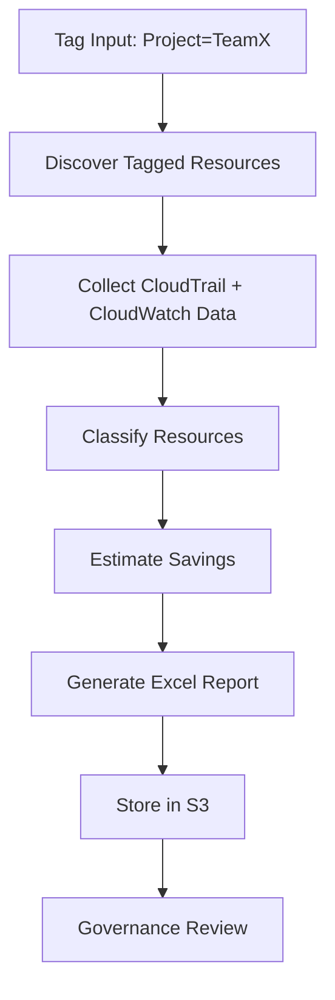

# Workflow

## Overview

The workflow for AWS-Stale-Resource-Analyzer is designed to answer one question clearly: which AWS resources belonging to a configured project tag appear stale, inactive, or unnecessary based on defined governance rules?

The workflow is structured, deterministic, and repeatable. It uses project tags as the root filter, then enriches the inventory with activity, usage, and cost information before generating a report.

## Step-by-step process

### Step 1: User provides target tags

The process starts when a user or operator defines the target project or business grouping. A common example is:

```text
Project=TeamX
```

This tag is used as the primary filter for resource discovery. Tagging discipline is essential because the quality of the output depends on the accuracy and consistency of the metadata applied to AWS resources.

### Step 2: Resources matching tags are discovered

AWS-Stale-Resource-Analyzer queries AWS services for resources that match the defined tag values. The inventory may include categories such as:

- EC2 instances
- EBS volumes
- Security groups
- Lambda functions
- RDS instances
- S3 buckets
- IAM resources
- Snapshots

The result is a curated list of project-associated resources that are then evaluated for inactivity or governance concern.

### Step 3: Activity data is collected

Once the resource inventory is assembled, the workflow gathers operational and performance evidence. This is where AWS telemetry helps separate active resources from stale ones.

Typical sources include:

- CloudTrail events for recent API-driven activity
- CloudWatch metrics for CPU, memory, requests, and utilization patterns
- Cost and usage signals from AWS billing data

This step ensures the report is guided by real usage patterns rather than just resource existence.

### Step 4: Resources are classified

Each discovered resource is classified based on the available signal. Classification supports governance review and helps prioritize investigation. Examples include:

- Active resource
- Low-usage resource
- Idle resource
- Candidate for decommissioning
- High-risk stale asset
- No recent activity but business-critical

Classification logic is intentionally deterministic and based on defined thresholds and evidence.

### Step 5: Potential savings are calculated

After classification, the workflow estimates the cost impact of resources that may be stale or unused. This includes cost signals from AWS billing and pricing data.

Examples of savings analysis:

- Monthly compute cost of an idle EC2 instance
- Storage cost associated with unattached EBS volumes
- Snapshot cost accumulation over time
- Lambda spend from unused or low-traffic functions
- RDS or attached service costs for inactive workloads

This step converts governance findings into a financial lens that supports FinOps review.

### Step 6: Excel report is generated

The findings are then compiled into a structured Excel workbook. The workbook is designed to be easy to review and share with stakeholders.

Key outputs typically include:

- Executive summary sheet
- Detailed resource sheets by service category
- Estimated savings and classification summaries
- Recommendation and review notes
- Historical comparison context where relevant

### Step 7: Report stored in S3

The final report is saved to Amazon S3 for long-term retention and historical analysis. This ensures the organization has a governance artifact that can be revisited during reviews, cost discussions, and compliance exercises.

## Workflow diagram



## Operational logic

The workflow is not reactive to a single event; it is intended to run on a recurring basis. In a typical cloud governance cycle, the system evaluates tagged resources on a schedule, compares current findings with stored historical reports, and helps stakeholders determine whether projects are still using provisioned resources efficiently.

This creates a consistent operational cadence:

- periodically scan the tagged project footprint
- assess active versus stale resources
- update the financial perspective
- produce a fresh report for review and distribution

## Why the process matters

This workflow transforms fragmented AWS inventory data into an actionable governance artifact. Rather than forcing project owners to inspect multiple consoles, the solution provides a repeatable and evidence-based method to identify risk, waste, and cleanup opportunities.

The process is especially valuable in environments where:

- Many resources are not centrally reviewed
- Tagging standards differ by team or project
- AWS environments are large and multi-region
- Cost accountability is distributed across business units
- Governance reviews need objective evidence before cleanup decisions

## Summary

AWS-Stale-Resource-Analyzer's workflow is intentionally simple: find project-tagged resources, determine whether they are active, classify their state, estimate the value of cleanup, and publish the results as a report. The workflow is built for repeatability, transparency, and practical governance decisions in AWS environments.
